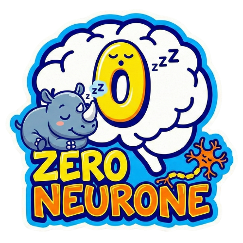

# ZeroNeurone

<p align="center">
  
</p>

**Outil d'amplification cognitive pour analystes et enqueteurs**

Un tableau blanc infini avec des capacites d'analyse de graphe.


## Philosophie

- **L'humain reste aux commandes** — Pas d'actions automatiques, Ni d'intelligence artificielle, suggestions uniquement sur demande
- **100% local par defaut** — IndexedDB + OPFS, fonctionne hors-ligne, les donnees ne partent jamais sans action explicite
- **Le visuel EST l'analyse** — Position spatiale, couleurs, formes portent un sens defini par l'utilisateur
- **Zero ontologie imposee** — Les utilisateurs creent leurs propres concepts, pas de types d'entites forces

## Fonctionnalites

### Canvas Interactif
- Creation d'elements par double-clic
- Liens entre elements par glisser-deposer
- Multi-selection et manipulation groupee
- Zoom et navigation fluides
- Personnalisation visuelle (couleurs, formes, tailles, icones)
- Groupes visuels imbriques
- Annotations (post-its)
- **Onglets canvas** : espaces thematiques par hypothese, type d'acteur, periode (max 10 par enquete)
- Elements fantomes : elements d'autres onglets connectes a l'onglet courant affiches en transparence
- Menu contextuel avec actions sur la selection et gestion des onglets
- Minimap pour navigation rapide
- Grille d'alignement magnetique

### Gestion des Donnees
- **Elements** : Noeuds du graphe (personnes, entreprises, lieux, concepts, documents...)
- **Liens** : Relations entre elements avec metadonnees completes
- **Proprietes** : Paires cle/valeur personnalisables
- **Tags** : Organisation libre et filtrage
- **Pieces jointes** : Images, PDF, documents avec extraction de texte (EXIF, metadonnees PDF/DOCX/XLSX)
- **Description Markdown** : Support complet avec tables, liens d'ancrage, code, citations

### Analyse de Graphe
- Detection de communautes (Louvain)
- Centralite (degre, intermediaire)
- Identification des ponts entre clusters (Tarjan O(V+E))
- Plus court chemin entre elements
- Mode focus (voisinage a N niveaux)
- Detection des noeuds isoles
- Analyse de similarite des labels

### Vues Multiples
- **Canvas** : Vue graphe principale
- **Carte** : Visualisation geographique (Leaflet) avec vue satellite
- **Timeline** : Frise chronologique virtualisee (10k+ elements)

### Collaboration Temps Reel
- Synchronisation via WebSocket avec chiffrement E2E (AES-256-GCM)
- Partage par lien avec cle dans le fragment URL (jamais envoyee au serveur)
- **Mode asynchrone** : collaborateurs travaillent a des moments differents, donnees bufferisees 7 jours
- Curseurs et selections des collaborateurs visibles
- Synchronisation des pieces jointes
- Synchronisation des onglets canvas (noms, membres, ordre — viewport local par utilisateur)
- Detection de presence avec heartbeat
- Sync incrementale optimisee
- Room ID hashe (le serveur ne peut pas correler les sessions)

### Export & Import
- Export ZIP complet (JSON + assets)
- Export PNG haute resolution (zoom/scale configurable)
- Export SVG natif (vectoriel)
- Export PDF du canvas
- Export CSV (avec positions/groupes)
- Export HTML interactif (rapport + graphe navigable, theme clair/sombre, TOC, stats)
- Import CSV pour donnees tabulaires
- Import GraphML pour donnees de graphes
- Import Excalidraw
- Import GEDCOM 5.5.1/7.0 et GeneWeb pour donnees genealogiques (nom, dates, lieux, profession, surnom, titre, notes)
- Import ZIP (restauration complete avec onglets)
- Import dans investigation courante (merge avec placement visuel)
- Panel Rapport (redaction Markdown avec references aux elements)
- Generation de synthese (rapport automatique avec analyse du graphe)
- [Format JSON d'import documente](docs/json-import-format-fr.md) ([EN](docs/json-import-format-en.md))

### Layouts Automatiques
- Force-directed (clusters)
- Hierarchique (arbres, organigrammes)
- Circulaire
- Grille
- Dispersion

### PWA & Hors-ligne
- Installation sur mobile et desktop
- Fonctionne 100% hors-ligne
- Cache intelligent des tuiles OpenStreetMap
- Service Worker avec mise a jour automatique

### Accessibilite (WCAG AA)
- Labels ARIA sur tous les controles interactifs
- Navigation complete au clavier
- Focus trap dans les modals
- Skip link pour acces rapide au contenu
- Contraste suffisant

### Internationalisation
11 langues supportees :
- Francais (fr)
- English (en)
- Espanol (es)
- Deutsch (de)
- Catala (ca)
- Euskara (eu)
- Italiano (it)
- Polski (pl)
- Portugues (pt)
- Ukrainska (ua)
- Nederlands (nl)

## Stack Technique

| Couche | Technologie |
|--------|-------------|
| Framework | React 19 + TypeScript + Vite |
| Etat | Zustand |
| Stockage | Dexie.js (IndexedDB) + OPFS |
| Canvas | React Flow |
| Carte | Leaflet + React-Leaflet |
| Analyse | Graphology |
| Recherche | MiniSearch |
| Sync | Yjs + y-websocket + y-indexeddb |
| Crypto | Web Crypto API (AES-256-GCM) |
| PWA | vite-plugin-pwa |
| Style | Tailwind CSS |
| Tests E2E | Playwright |

## Installation

```bash
# Cloner le repo
git clone https://github.com/votre-username/zeroneurone.git
cd zeroneurone

# Installer les dependances
npm install

# Lancer en developpement
npm run dev
```

L'application sera accessible sur `http://localhost:5173`

## Utilisation

### Raccourcis Clavier

| Action | Raccourci |
|--------|-----------|
| Recherche | `Ctrl+K` |
| Copier | `Ctrl+C` |
| Couper | `Ctrl+X` |
| Coller | `Ctrl+V` |
| Dupliquer | `Ctrl+D` |
| Annuler | `Ctrl+Z` |
| Retablir | `Ctrl+Shift+Z` |
| Supprimer selection | `Delete` / `Backspace` |
| Mode focus | `F` |
| Nouvel element | `E` |
| Nouveau groupe | `G` |
| Nouvelle annotation | `N` |
| Vue Canvas | `1` |
| Vue Carte | `2` |
| Vue Timeline | `3` |

### Interactions Canvas

| Action | Resultat |
|--------|----------|
| Double-clic sur le canvas | Creer un element |
| Glisser d'element a element | Creer un lien |
| Glisser d'element vers le vide | Creer un nouvel element lie |
| Clic droit | Menu contextuel |
| Molette | Zoom |
| Clic molette + glisser | Pan |

### Collaboration

1. Ouvrir une enquete
2. Cliquer sur "Partager" dans la barre d'outils
3. Configurer l'URL du serveur de signalisation (une seule fois)
4. Activer le mode asynchrone si besoin (collaborateurs travaillant a des moments differents)
5. Copier le lien de partage
6. Les collaborateurs ouvrent le lien pour rejoindre

> **Important** : En mode asynchrone, conservez le lien de partage. C'est le seul moyen de rejoindre la session et dechiffrer les donnees.

Voir la [documentation](https://doc.zeroneurone.com) pour les details.

## Architecture

```
src/
├── components/
│   ├── canvas/          # Canvas et elements graphiques
│   ├── map/             # Vue carte (Leaflet)
│   ├── timeline/        # Vue chronologique
│   ├── panels/          # Panneaux lateraux
│   ├── collaboration/   # UI de collaboration
│   ├── modals/          # Dialogues modaux
│   └── common/          # Composants partages
├── stores/              # Stores Zustand
│   ├── investigationStore.ts   # Donnees (elements, liens, assets)
│   ├── selectionStore.ts       # Etat de selection
│   ├── viewStore.ts            # Viewport, filtres, mode d'affichage
│   ├── uiStore.ts              # Etat UI (modals, panels, toasts)
│   ├── syncStore.ts            # Etat de synchronisation
│   └── insightsStore.ts        # Cache d'analyse de graphe
├── db/
│   ├── database.ts             # Configuration Dexie
│   └── repositories/           # CRUD par entite
├── services/
│   ├── syncService.ts          # Gestion Y.Doc et providers
│   ├── cryptoService.ts        # Chiffrement E2E
│   ├── searchService.ts        # Integration MiniSearch
│   ├── insightsService.ts      # Analyse Graphology (Web Worker)
│   ├── fileService.ts          # Gestion OPFS
│   ├── importService.ts        # Import ZIP/CSV
│   └── exportService.ts        # Export ZIP/PNG/PDF
├── workers/                    # Web Workers (analyse, layout)
├── i18n/                       # Traductions (11 langues)
├── types/                      # Types TypeScript
└── utils/                      # Utilitaires
```

### Stockage

- **Metadonnees** (elements, liens, vues) : IndexedDB via Dexie
- **Fichiers binaires** (assets) : OPFS avec deduplication SHA-256
- **Synchronisation** : Y.Doc avec persistence IndexedDB locale
- **Index de recherche** : MiniSearch, reconstruit au chargement

### Securite Collaboration

```
┌─────────────┐         ┌─────────────────┐         ┌─────────────┐
│  Client A   │◄───────►│ Serveur Signal  │◄───────►│  Client B   │
│             │  Donnees│   (y-websocket) │  Donnees│             │
│ Cle: xxxxx  │ chiffrees    Relais      │ chiffrees│ Cle: xxxxx  │
└─────────────┘         └─────────────────┘         └─────────────┘
```

- Chiffrement de bout en bout (E2E) avec AES-256-GCM
- Cle de chiffrement generee cote client
- Cle transmise uniquement via fragment URL (`#key=...`)
- Le serveur de signalisation ne voit que des donnees chiffrees
- Aucune donnee en clair ne transite par le serveur

## Developpement

```bash
# Developpement avec hot-reload
npm run dev

# Verification TypeScript
npm run typecheck

# Tests E2E
npm run test:e2e

# Tests E2E avec interface
npm run test:e2e:ui

# Linting
npm run lint

# Build production
npm run build

# Previsualisation du build
npm run preview
```

### Serveur de Signalisation

Pour la collaboration, vous pouvez utiliser :

```bash
# Serveur y-websocket inclus
npm run sync-server
```

Ou deployer votre propre serveur y-websocket.

## Modele de Donnees

### Element
```typescript
{
  id: UUID
  investigationId: UUID
  label: string
  notes: string
  tags: string[]
  properties: Property[]
  confidence: number | null      // 0-100
  source: string
  date: Date | null
  dateRange: { start, end } | null
  position: { x, y }
  geo: { lat, lng } | null
  visual: {
    color: string
    borderColor: string
    shape: 'rectangle' | 'ellipse' | 'diamond' | 'hexagon'
    size: 'small' | 'medium' | 'large'
    icon: string | null
    image: string | null
  }
  assetIds: string[]
  isGroup: boolean
  parentGroupId: UUID | null
  childIds: UUID[]
}
```

### Link
```typescript
{
  id: UUID
  investigationId: UUID
  fromId: UUID
  toId: UUID
  label: string
  notes: string
  tags: string[]
  properties: Property[]
  directed: boolean
  direction: 'none' | 'forward' | 'backward' | 'both'
  confidence: number | null
  visual: {
    color: string
    style: 'solid' | 'dashed' | 'dotted'
    thickness: number
  }
  curveOffset: { x, y }
}
```

## Roadmap

### v1.0 — Stabilisation ✓
- [x] Tests E2E Playwright
- [x] PWA complete
- [x] Accessibilite WCAG AA
- [x] i18n (11 langues)
- [x] Documentation utilisateur : [doc.zeroneurone.com](https://doc.zeroneurone.com)
- [x] Error boundaries
- [x] Import STIX2

### v1.1 — Analyse avancee
- [ ] Betweenness centrality
- [x] Filtre temporel sur timeline
- [ ] Export des resultats d'analyse

### v1.2 — Integration ✓
- [x] Import/merge d'investigations dans le canvas courant
- [ ] Import depuis tableur avec mapping colonnes

### v2.0 — Collaboration asynchrone ✓
- [x] Mode asynchrone (travail decale, buffer 7 jours)
- [x] Protection des metadonnees (room ID hashe)
- [x] Ancrage automatique des connecteurs par defaut

### v2.5 — Performance collaborative ✓
- [x] Sync incrementale Y.js optimisee (requestAnimationFrame batching)
- [x] Elimination du double-render canvas (displayNodes conditionnel)
- [x] Debounce edgeVersion (300ms, reduction des recalculs edges)
- [x] Warmup crypto bloquant (fix cold start Firefox 3s)
- [x] SimpleEdge leger pour les graphes denses
- [x] Seuil adaptatif masquage edges (500+ elements)
- [x] Teste avec 1500+ elements/liens en mode collaboratif
- [x] HD image LOD (chargement progressif images pleine resolution)

### v2.8 — Onglets canvas ✓
- [x] Onglets canvas : espaces thematiques (hypothese, type d'acteur, periode)
- [x] Barre d'onglets avec vue globale "Tous", onglets nommes, bouton "+" (max 10)
- [x] Elements fantomes : elements d'autres onglets connectes affiches en transparence
- [x] Menu contextuel : ajouter/retirer des onglets, naviguer vers l'onglet source
- [x] Synchronisation Y.js des onglets en mode collaboratif
- [x] Export/import ZIP et JSON avec onglets
- [x] Recherche (Ctrl+K) bascule automatiquement sur le bon onglet
- [x] Vues sauvegardees memorisent l'onglet actif
- [x] Undo/redo des changements d'appartenance aux onglets

### Idees futures
- [ ] Theming personnalisable
- [ ] Mode presentation

## Contribuer

Les contributions sont les bienvenues ! N'hesitez pas a ouvrir une issue ou une pull request.

## Licence

[MIT](LICENSE) - Yann PILPRÉ 2026
